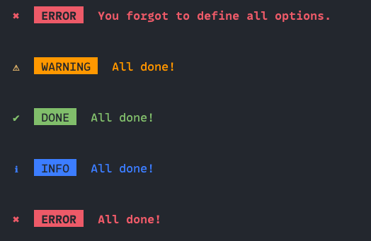

# cli-alerts



## Install

```sh
npm install cli-info
```

<br>

## Usage

```js
import alert from 'cli-info';

// Provide the type, msg, and name options.
alert(`success`, `Everything finished!`);
// Prints: ✔ SUCCESS Everything finished!

alert(`success`, `Everything finished!`, `DONE`);
// Prints: ✔ DONE Everything finished!

alert(`warning`, `You didn't add something!`);
// Prints: ⚠ WARNING You didn't add something!

alert(`info`, msg: `gsambou is awesome!`);
// Prints: ℹ INFO gsambou is awesome!

alert(`error`, msg: `Something went wrong!`);
// Prints: ✖ ERROR Something went wrong!
```

### Note

Only: `info`, `success`, `warning`, `error` colorations are available
